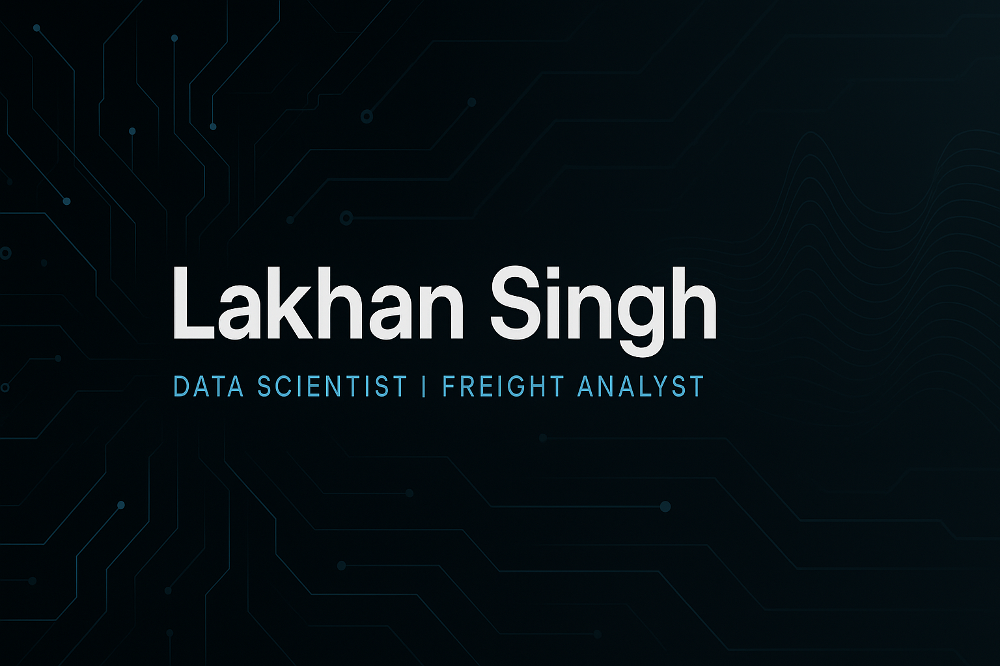

<!-- Animated Banner -->

  

<!-- Animated Name -->
<h1 align="center">
   
  Hi, I'm Lakhan Singh
</h1>

<!-- Typing Animation -->

  

  
  
  

---

<!-- Gradient Line -->

## 🧑‍💻 **About Me**

✨ Freight Analyst at **Emendate**  
🚢 Auditing global **ocean & air freight shipments**  
👓 Clients: *LyondellBasell* | *Luxottica*  
📊 Passion: **Data Science + Supply Chain Analytics**  
🧠 Motto: *“Hustle. Focus. Faith.”*  
📍 Based in **Ahmedabad, India**

---

## ⚡ **Skills **

  

  

---

## 🚀 **Featured Portfolio Projects **

### 🔹 **1. Marketing Campaign Performance Dashboard – Power BI**
📌 ROI | Conversions | Channel Performance  
⏳ *In Progress – Repo Coming*  

---

### 🔹 **2. Freight Invoice Audit Automation – Python**
📌 Detects overbilling, FX mismatch, wrong surcharges  
📌 Generates audit report in seconds  
⏳ *In Progress – Repo Coming*

---

### 🔹 **3. Freight Anomaly Detection – ML**
📌 Isolation Forest | LOF | DBSCAN  
📌 Detects abnormal charge patterns  
⏳ *In Progress – Repo Coming*

---

## 🔥 **Freight Analyst Experience **

### 💼 **Emendate — Freight Analyst**
**I audit freight invoices for:**

✔ Ocean & Air shipments  
✔ Lane validation (POL → POD)  
✔ Carrier charges & surcharges  
✔ Contract rate matching  
✔ FX validation  
✔ Duplicate invoice detection  

🎯 **Goal:** Build automated freight audit systems using  
Python + Machine Learning + Power BI.

---

## 📈 **GitHub Analytics **

  
  

  

---

## 🧠 **Learning Roadmap: 2025**

- Python for automation  
- SQL advanced  
- Machine Learning  
- Time Series for forecasting  
- Freight + Supply Chain analytics  
- Power BI dashboards  
- GitHub projects every month  
- Freelancing on Upwork, Fiverr & LinkedIn  

---

## 🤝 **Let's Connect**

- 🔗 LinkedIn: **[Lakhan Singh](https://www.linkedin.com/in/lakhansingh-dataanalyst/)**
- 🐙 GitHub: **[Lakhan-gehlot](https://github.com/Lakhan-gehlot)**
- 📧 Email: **lakhangehlot457@gmail.com**

  

